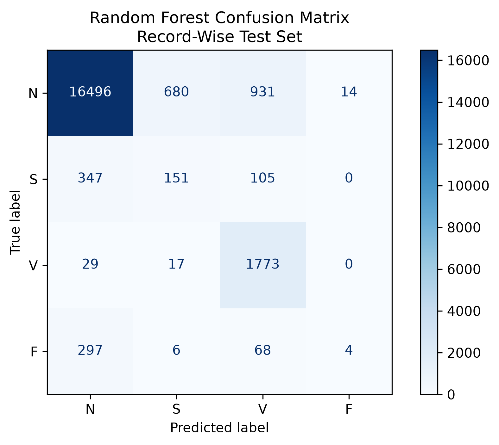
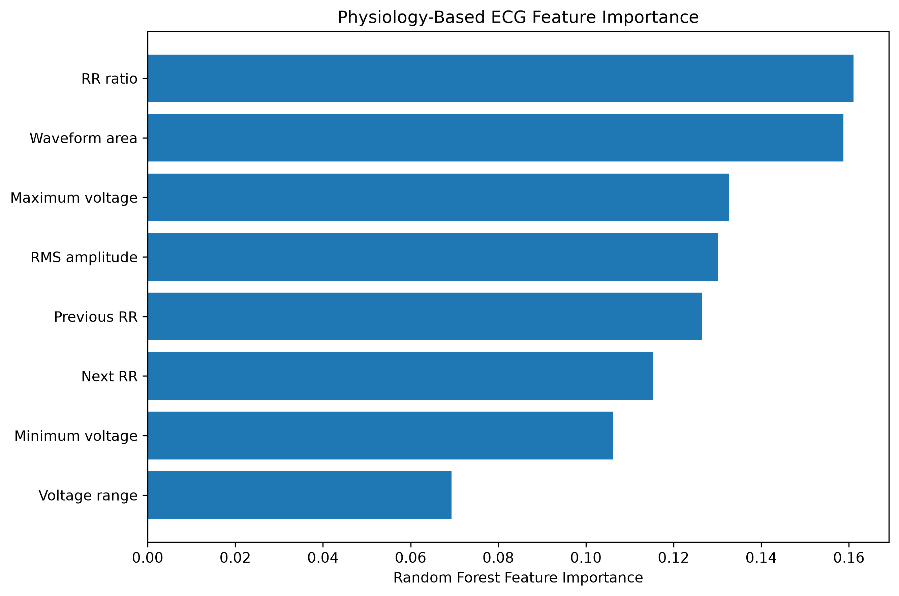
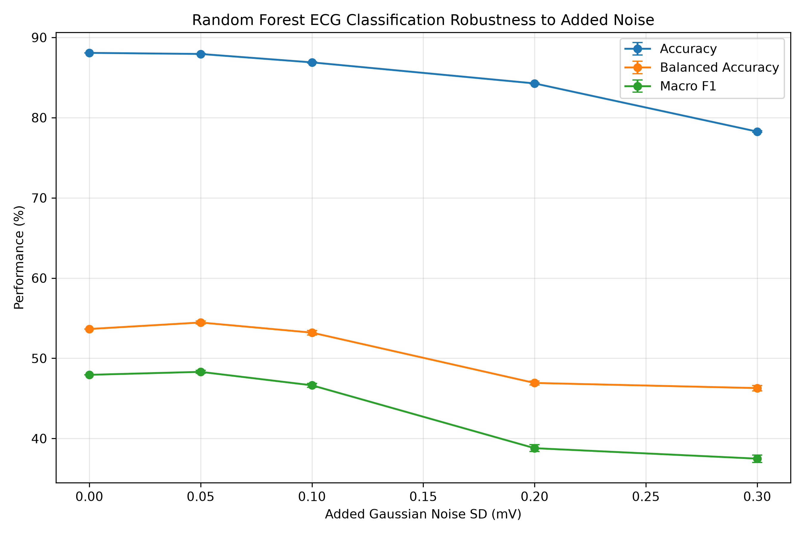
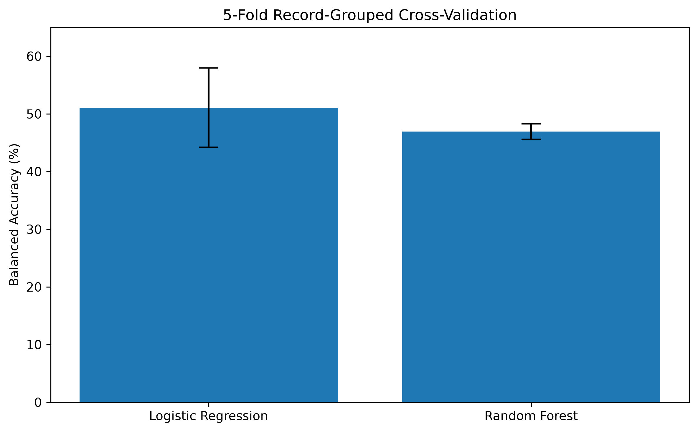
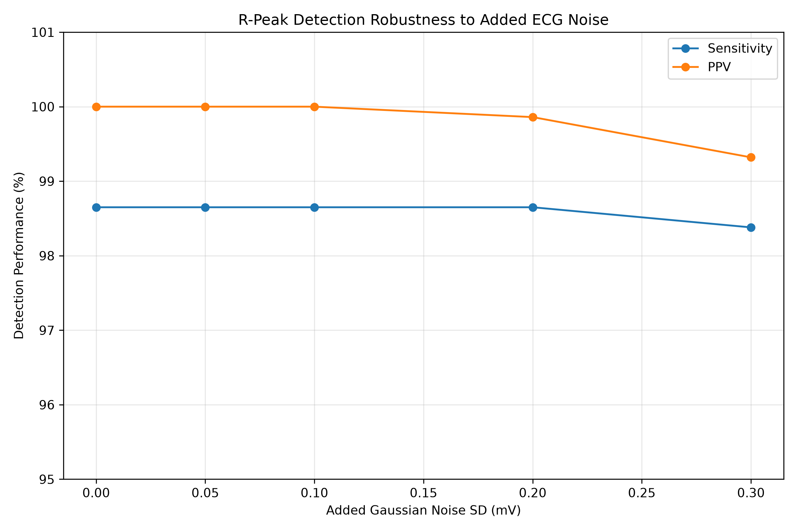

# ECG Arrhythmia Detection & Signal Robustness Analysis

A biomedical engineering project that combines ECG signal processing,
physiological feature engineering, machine learning, validation, and
signal-quality analysis using the MIT-BIH Arrhythmia Database.

## Project Overview

Electrocardiograms (ECGs) measure electrical activity associated with
the heart's activation and recovery. Abnormal heartbeat patterns can
appear through changes in beat timing, waveform morphology, or both.

This project develops an engineering pipeline to:

1. Process real ECG recordings.
2. Detect R-peaks and calculate cardiac timing measurements.
3. Segment continuous ECG recordings into individual heartbeats.
4. Extract physiologically motivated timing and morphology features.
5. Classify grouped heartbeat types using machine learning.
6. Evaluate generalization using record-wise validation.
7. Test sensitivity to controlled signal noise.
8. Evaluate whether filtering can recover performance.
9. Present the analysis through an interactive Streamlit dashboard.

This project is an educational engineering prototype and is not a
clinical diagnostic system.

## Biomedical Engineering Pipeline

ECG Recording  
↓  
Signal Processing  
↓  
R-Peak Detection  
↓  
RR Interval / Heart Rate Analysis  
↓  
Heartbeat Segmentation  
↓  
Physiological Feature Engineering  
↓  
Machine-Learning Classification  
↓  
Record-Wise Validation  
↓  
Signal Robustness Analysis  
↓  
Interactive Dashboard

## Dataset

The project uses the MIT-BIH Arrhythmia Database from PhysioNet.

The database contains 48 approximately 30-minute, two-channel ECG
recordings sampled at 360 Hz with expert heartbeat annotations.

Expert annotations were used as reference labels for heartbeat
segmentation and classification.

## ECG Physiology

An ECG measures voltage differences at the body surface produced by
the heart's electrical activity.

Important waveform components include:

- **P wave:** atrial depolarization.
- **QRS complex:** ventricular depolarization.
- **R-peak:** prominent point in the QRS complex useful for locating
  heartbeats.
- **T wave:** ventricular repolarization.
- **RR interval:** time between consecutive R-peaks.

Beat timing is important because premature beats may occur earlier
than the surrounding rhythm even when average heart rate appears
normal.

## Heartbeat Segmentation

Continuous ECG recordings were divided into heartbeat-centered
segments using expert beat annotations.

Each segment contains:

- 0.3 seconds before the annotated beat.
- 0.4 seconds after the annotated beat.
- 0.7 seconds total.

At 360 Hz, each heartbeat segment contains 252 ECG samples.

The full processed dataset contained 108,435 heartbeat segments before
the primary classification exclusions.

## Heartbeat Classes

Expert heartbeat symbols were grouped into physiologically related
categories:

- **N:** normal-type beats
- **S:** supraventricular ectopic beats
- **V:** ventricular ectopic beats
- **F:** fusion beats
- **Q:** paced/other category used during dataset processing

The primary machine-learning classifier was evaluated on N, S, V,
and F classes.

## Feature Engineering

Eight features were extracted from each heartbeat.

### Morphology Features

1. Maximum voltage
2. Minimum voltage
3. Voltage range
4. RMS amplitude
5. Waveform area

A local median baseline correction was applied before calculating
morphology features.

### Timing Features

6. Previous RR interval
7. Next RR interval
8. RR ratio

The RR ratio represents beat timing relative to the surrounding
rhythm.

Combining timing and morphology allows the model to use both when a
heartbeat occurs and the shape of its electrical waveform.
## Key Results

### Heartbeat Classification

The Random Forest achieved **88.08% overall accuracy** on held-out
ECG records, with **97.5% recall for ventricular ectopic (V) beats**.
Performance varied substantially across heartbeat classes, emphasizing
the importance of class-specific evaluation.



### Physiological Feature Importance

The model used both heartbeat timing and ECG morphology. RR ratio and
waveform area were the two highest-importance engineered features.



### Signal-Noise Robustness

Controlled noise experiments were used to determine how decreasing
ECG signal quality affected classification performance.



### Group-Aware Validation

Performance was also evaluated with GroupKFold cross-validation,
keeping ECG records separated between folds to better assess
generalization across recordings.



## Machine Learning

Two classifiers were evaluated:

- Logistic Regression
- Random Forest

A record-wise split was used so that beats from the same ECG recording
were not placed in both the training and held-out test sets.

This reduces leakage compared with randomly splitting individual
heartbeats from the same recording.

### Held-Out Random Forest Results

- **Overall accuracy:** 88.08%
- **Balanced accuracy:** 53.65%
- **V-class recall:** 97.5%

The high overall accuracy should not be interpreted as equally strong
performance across all heartbeat classes. The dataset is strongly
imbalanced, and performance was substantially weaker for some minority
classes.

## Grouped Cross-Validation

Five-fold GroupKFold cross-validation was performed using training
records.

Random Forest:

- **Mean balanced accuracy:** 46.92% ± 1.32 percentage points
- **Mean macro F1:** 0.404 ± 0.051

Logistic Regression:

- **Mean balanced accuracy:** 51.09% ± 6.87 percentage points
- **Mean macro F1:** 0.418 ± 0.037

These results demonstrate why overall accuracy alone can be misleading
for imbalanced biomedical classification problems.

## Feature Importance

The two highest Random Forest feature importances were:

1. **RR ratio:** 0.1611
2. **Waveform area:** 0.1588

This suggests that both heartbeat timing and waveform morphology were
useful to the trained classifier.

Feature importance represents usefulness to the model and should not
be interpreted as physiological causality.

## Signal-Quality and Noise Robustness

Controlled Gaussian noise was added to held-out ECG beats without
retraining the classifier.

Random Forest accuracy decreased from:

- **88.08% at 0.00 mV added noise**
- to **78.26% at 0.30 mV added noise**

Macro F1 decreased from 0.479 to 0.375.

The classifier was also tested against simulated baseline wander and
was more robust to this slow disturbance than to Gaussian noise at the
tested amplitudes.

These experiments demonstrate that model performance depends on signal
quality.

## Filtering Experiment

A 0.5-40 Hz band-pass filter was evaluated under 0.20 mV Gaussian
noise.

After consistent baseline correction, filtering reduced waveform RMSE
from approximately:

- **0.1874 mV to 0.0923 mV**

This was approximately a 51% reduction.

For classification under the same noise condition:

- Balanced accuracy increased from **46.93% to 51.66%**
- S-class recall increased from **2.65% to 20.56%**
- Overall accuracy decreased slightly from **84.27% to 83.65%**

This illustrates an engineering tradeoff: preprocessing can improve
minority-class detection without necessarily improving overall
accuracy.

## R-Peak Detection Robustness

R-peak detection was separately evaluated on a 60-second section of
MIT-BIH Record 100 against expert heartbeat locations.

Clean signal:

- **Sensitivity:** 98.65%
- **Positive Predictive Value (PPV):** 100%

At 0.30 mV Gaussian noise:

- **Sensitivity:** approximately 98.38%
- **PPV:** approximately 99.32%

R-peak detection therefore remained relatively robust under the tested
noise while heartbeat classification degraded more substantially.

This shows that detecting where a heartbeat occurs and determining
what type of heartbeat it is are separate engineering problems.


## Interactive Dashboard

A Streamlit dashboard was developed to visualize the ECG analysis.

The dashboard includes:

- Raw ECG visualization
- Detected R-peaks
- Expert heartbeat annotations
- Heart rate and RR interval measurements
- Interactive heartbeat selection
- Individual heartbeat morphology
- Engineered model features
- Random Forest heartbeat classification
- Model probability estimates
- Noise robustness results
- Filtering results
- Feature importance
- Held-out validation metrics
- Engineering limitations

MIT-BIH Record 100 is used as an interactive demonstration. Individual
predictions from this demonstration should not be interpreted as
held-out validation results because Record 100 was used during model
development/training.

## Engineering Limitations

Important limitations include:

- Expert annotations were used for heartbeat segmentation and labels.
- The classifier is therefore not a completely end-to-end arrhythmia
  detection system.
- Next-RR timing uses information from the following heartbeat, making
  the classifier offline/delayed rather than instantaneous real-time.
- The primary model excludes the Q/paced-other category.
- ECG lead configurations can vary between recordings.
- Record-wise separation should not automatically be interpreted as a
  guaranteed patient-wise split.
- Minority heartbeat classes remain difficult to classify.
- Synthetic noise does not reproduce every real-world ECG artifact.
- Per-beat filtering may introduce boundary effects.
- Random Forest probability estimates are not calibrated clinical
  probabilities.
- The system has not been validated for clinical use.

## Tools

- Python
- NumPy
- SciPy
- pandas
- WFDB
- NeuroKit2
- scikit-learn
- Matplotlib
- Plotly
- Streamlit

## Project Structure

```text
ECG-Arrhythmia-Detection/
├── app/
│   └── dashboard.py
├── data/
│   └── processed_heartbeat_dataset.npz
├── results/
│   ├── random_forest_confusion_matrix.png
│   ├── random_forest_feature_importance.png
│   ├── grouped_cv_model_comparison.png
│   ├── random_noise_robustness_curve.png
│   ├── per_class_noise_sensitivity.png
│   ├── filtering_recovery_example.png
│   ├── baseline_corrected_filtering_example.png
│   ├── rpeak_noise_robustness.png
│   └── random_forest_model.joblib
├── src/
│   ├── explore_ecg.py
│   ├── build_dataset.py
│   ├── download_data.py
│   ├── build_full_dataset.py
│   ├── extract_features.py
│   ├── train_model.py
│   ├── noise_robustness.py
│   └── rpeak_robustness.py
├── .gitignore
├── README.md
├── requirements.txt
└── test_setup.py